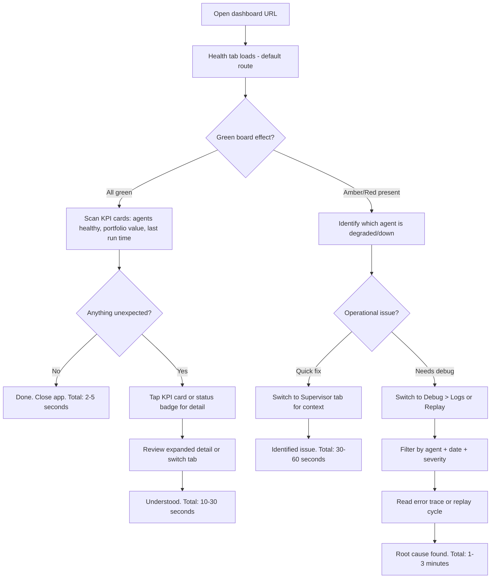
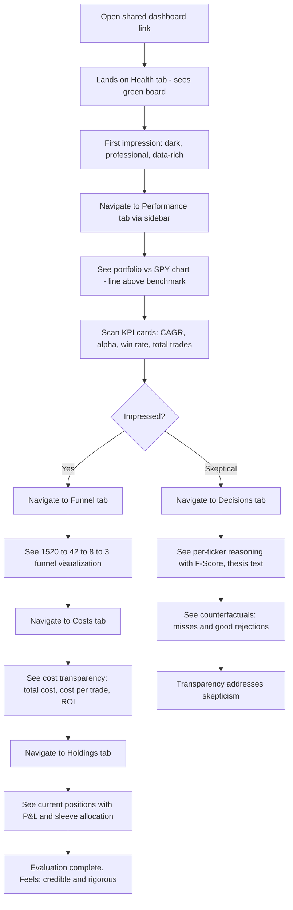
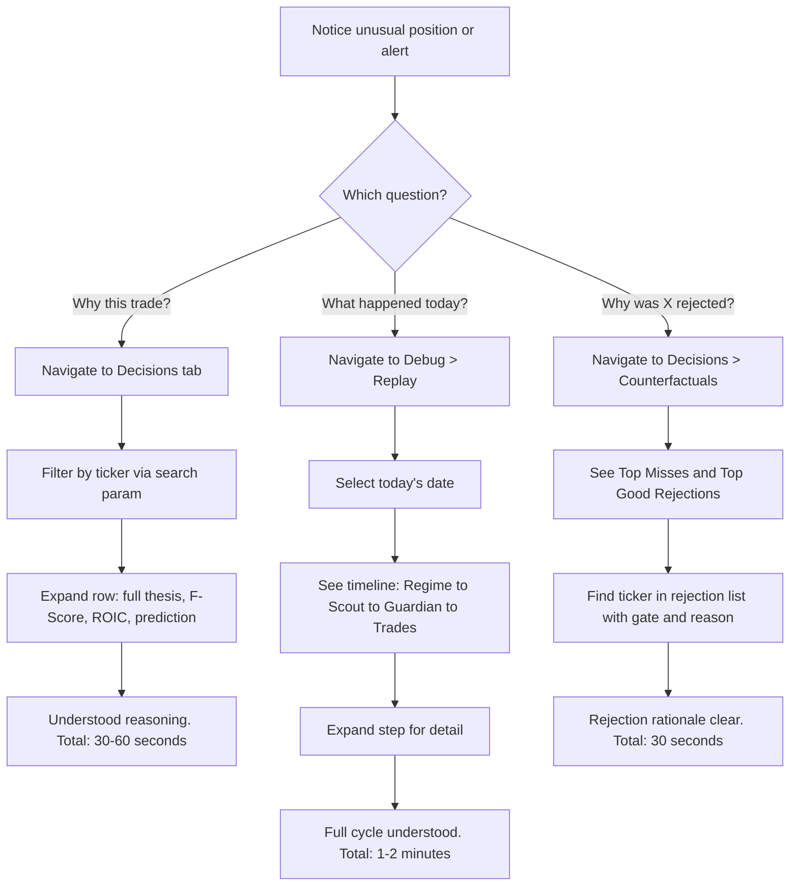

# UX Design Specification: Portfolio System Dashboard

**Author:** Omri
**Date:** 2026-04-04

---

<!-- UX design content will be appended sequentially through collaborative workflow steps -->

## Executive Summary

### Project Vision

A read-only monitoring dashboard for an autonomous investment pipeline system. Serves as both an operational control center (for Omri — daily use, mobile + desktop) and a credible performance showcase (for potential investors). Dark theme, professional aesthetic — Bloomberg terminal meets modern fintech.

### Target Users

**Omri (Primary — Operator)**
Daily operational monitoring across mobile and desktop. Checks pipeline health on morning commute, monitors holdings during the day, debugs issues in the evening. Needs: speed, data density, drill-down capability. Emotional goal: feel in control of the machine.

**Potential Investors (Secondary — Evaluator)**
Read-only access to evaluate system credibility and performance. Focused on Performance, Holdings, Costs, and Funnel tabs. Never sees Debug tab (hidden entirely from investor view, not rendered). Emotional goal: feel confidence in the system's rigor and returns.

### Key Design Challenges

1. **Dual-audience tension**: Same dashboard serves operator (data-dense, operational) and investor (polished, credible). Debug tab hidden from investor view entirely. Investor-visible tabs must stand alone as a professional presentation.

2. **Data density on mobile**: Holdings (15+ columns), debug logs, funnel drill-downs are inherently wide views. Progressive disclosure strategy required — summary cards on mobile, full tables on desktop.

3. **Navigation for 8 tabs**: Desktop uses sidebar. Mobile uses hamburger menu (not bottom nav) — keeps the viewport clean for data-heavy content and handles 8 items gracefully. Investor view shows 7 tabs (Debug hidden).

4. **Glanceable status vs deep inspection**: Health tab must communicate system state in <2 seconds. Debug tab needs full JSON payloads and stack traces. Visual language must span both without feeling disjointed.

### Design Opportunities

1. **"Green board" ambient status**: Health tab uses color as ambient information. When all agents are healthy and portfolio is up, the entire tab radiates calm green energy. Degraded components shift to amber/red with immediate visual urgency — no need to read text to know something's wrong.

2. **Funnel as narrative visualization**: The funnel tells a compelling story for both audiences — "1,520 tickers entered, 42 survived, 3 were traded." A beautiful, well-proportioned funnel/waterfall chart that works as both operational data and investor-impressive visualization.

3. **Timeline as debug superpower**: Pipeline replay with a chronological, expandable timeline makes debugging feel effortless. Unique feature that replaces SSH + grep with a visual experience.

## Core User Experience

### Defining Experience

**Omri's core loop:** Open dashboard → see system status → decide if action needed. This happens multiple times daily, primarily on mobile. The entire Health tab must communicate "all clear" or "attention needed" in under 2 seconds through ambient color (green board effect) before any text is read.

**Investor's core loop:** Open Performance tab → see returns vs benchmark → evaluate credibility. This happens occasionally but each visit is high-stakes. The Performance tab must feel like a polished pitch deck, not a dev dashboard.

**Shared core action:** Glance → comprehend → (optionally) drill down. Every tab follows this pattern: summary at the top, detail below.

### Platform Strategy

- **Web application** — responsive SPA, no native app needed
- **Mobile-first for Omri** — most frequent access is phone (morning check, on-the-go monitoring). Desktop for deep analysis and debugging.
- **Desktop-first for investors** — they'll evaluate on laptop/desktop
- **Touch and mouse** — mobile interactions are tap/scroll, desktop adds hover tooltips on charts and column sorting
- **No offline requirement** — always connected, real-time data
- **Hamburger menu on mobile** — clean viewport for data-heavy content, expands to full-screen overlay with all navigation items

### Effortless Interactions

1. **Status comprehension without reading** — The green board effect means you understand system health from color alone. Green = calm, amber = attention, red = urgent. No need to read text to know the state.

2. **Tab switching preserves context** — Navigate away and back, your scroll position and filter state are preserved in URL search params (TanStack Router). No lost work, no re-filtering.

3. **Date/filter persistence in URL** — Share a specific funnel view or debug query by copying the URL. Bookmarkable, shareable states.

4. **Auto-refresh without interruption** — Health and Supervisor tabs poll every 30s. Data updates silently without scroll jumps, loading flickers, or focus loss. If you're reading a row, it doesn't move.

5. **Progressive disclosure everywhere** — Mobile shows summary cards; tap to expand. Desktop shows full tables with expandable rows for detail. You never see more than you need at your current depth.

### Critical Success Moments

1. **"Everything is green" moment** — First load of Health tab. All agents healthy, portfolio up. You feel calm confidence in 2 seconds. This is the most frequent interaction and must be flawless.

2. **"This system beats the market" moment** — Investor opens Performance tab. Sees portfolio line above SPY line. CAGR number is clear and prominent. Alpha is positive. They feel: "this is real."

3. **"I can see exactly why" moment** — Omri clicks a ticker in Decisions, sees the full thesis, F-Score breakdown, and prediction outcome. The system's reasoning is transparent and auditable.

4. **"Found the issue in 30 seconds" moment** — Something looks wrong on Health. Switch to Debug > Replay, select today's date, see the timeline. The bug is obvious. No SSH needed.

### Experience Principles

1. **Color before text** — Status is communicated through ambient color first, text second. Users should understand the state of things before reading a single word.

2. **Summary up, detail down** — Every tab starts with KPI cards or status badges at the top, detailed tables and charts below. Scroll = deeper inspection.

3. **One tab, one question** — Each tab answers a single question: "Is it healthy?" (Health), "What's my P&L?" (Holdings), "Is it profitable?" (Performance). The tab name IS the question.

4. **Investor-safe by default** — The 7 visible tabs (excluding Debug) must always feel professional and credible. No raw JSON, no dev jargon, no broken layouts on any investor-visible surface.

5. **Don't interrupt the glance** — Auto-refresh, polling, and data updates must never cause layout shifts, scroll jumps, or loading flickers. The dashboard is a calm instrument panel, not a flickering terminal.

## Desired Emotional Response

### Primary Emotional Goals

**For Omri:** Quiet confidence and control. The dashboard should feel like a well-calibrated instrument panel — not exciting, not alarming, just precisely informative. The dominant emotion is calm certainty: "the system is working and I can see everything."

**For Investors:** Institutional trust. The dashboard should feel like something a serious fund would build — not a side project, not a prototype. The dominant emotion is credibility: "this is real, rigorous, and well-engineered."

### Emotional Journey Mapping

**Omri's daily emotional arc:**
1. **Open (0-2s):** Relief or alertness — green board = relief, any amber/red = focused alertness (not panic)
2. **Scan (2-10s):** Comprehension — status badges and KPI cards convey the full picture without scrolling
3. **Decide (10-30s):** Either satisfaction ("all good, done") or purposeful investigation ("let me check this")
4. **Drill-down (if needed):** Discovery — expanding a row or switching tabs feels like zooming in on a map, not entering a different app
5. **Close:** Confidence — "I know the state of my system"

**Investor's evaluation arc:**
1. **First impression (0-3s):** Credibility — dark, professional, data-rich but not cluttered
2. **Performance scan (3-15s):** Conviction — clear returns, clear benchmark comparison, clear alpha
3. **Exploration (15-60s):** Respect — the funnel visualization, decision reasoning, and cost transparency show rigor and intellectual honesty
4. **Close:** Trust — "I'd want to learn more about this system"

### Micro-Emotions

**Confidence over confusion** — Every number has context. P&L shows both absolute and percentage. Agent status shows "last run: 2 hours ago" not just "healthy." Users never wonder "what does this mean?"

**Trust over skepticism** — Transparency is the trust engine. Show the reasoning, show the costs, show the misses (counterfactuals). A system that hides nothing feels trustworthy.

**Calm over anxiety** — Degraded status uses amber, not red. Red is reserved for genuine failure. The emotional gradient is: green (all clear) → amber (attention, not urgency) → red (action needed). Most of the time, the dashboard should feel green and calm.

**Efficiency over frustration** ��� No dead clicks, no loading spinners that block interaction, no filters that reset when you navigate away. Every interaction respects the user's time and context.

### Design Implications

- **Confidence** → Every data point has a label, unit, and context. No orphaned numbers. KPI cards show trend direction (up/down arrow) alongside the value.
- **Trust** → Counterfactual section on Decisions tab, cost transparency on Costs tab, calibration honesty on Performance tab. Don't hide failures.
- **Calm** → Muted color palette with green/amber/red as functional accents, not decorative elements. Dark background absorbs visual noise. White space (dark space) between sections gives the eye rest.
- **Efficiency** → Skeleton loading (instant perceived response), preserved filter state in URL, no unnecessary confirmation dialogs or modals.

### Emotional Design Principles

1. **Reassurance by default** — The dashboard's resting state should feel like "everything is fine." Urgency is the exception, not the norm.

2. **Transparency builds trust** — Show the good and the bad. Counterfactuals, calibration scores, and costs are features, not liabilities.

3. **Respect the user's time** — No friction between intention and result. One tap to navigate, instant visual feedback, zero unnecessary steps.

4. **Professional restraint** — No animations for the sake of animations. No color for the sake of color. Every visual element earns its place by conveying information.

## UX Pattern Analysis & Inspiration

### Inspiring Products Analysis

**TradingView — Chart Aesthetic & Data Hierarchy**
What they nail: Dark theme that makes data pop. Charts are the hero — large, interactive, with subtle gridlines that guide the eye without competing with data. Color is functional (green/red for price movement), never decorative. Data density is high but layered — summary at the top, detail on hover/click. Typography is small but legible, using weight (not size) to create hierarchy.
What we take: Chart-forward layout on Performance, Funnel, and Costs tabs. Dark background with high-contrast data. Recharts styling should emulate TradingView's clean gridlines, muted axis labels, and bold data lines.
What we leave: The complexity of their toolbar-heavy interface. We don't need drawing tools, indicator overlays, or multi-panel chart layouts.

**Linear — Navigation & Spacing Restraint**
What they nail: Sidebar navigation that's minimal and never fights for attention. Generous spacing between elements without feeling empty. Every pixel of white space is intentional. The sidebar collapses cleanly on narrow viewports. Typography is quiet — medium weight, restrained sizing, consistent rhythm. No visual noise. The UI disappears and the content speaks.
What we take: Sidebar navigation pattern (desktop). Spacing rhythm — consistent padding between cards, sections, and table rows. The principle that navigation should be invisible until you need it. Hamburger menu behavior on mobile.
What we leave: Their keyboard-shortcut-heavy interaction model. Their issue/project metaphor doesn't map to our tab-based dashboard.

**Vercel — Ambient Status Language**
What they nail: Deployment status communicates through color before you read any text. Green dot = deployed, red dot = failed, yellow = building. The status dots are small but unmistakable. The overall page "feels" green when everything is working. Error states are clear without being alarming — they show what went wrong and what to do next, not just a red banner.
What we take: Status badge pattern for agent health (small colored dot + text label). The "green board" ambient effect — when all agents are healthy, the Health tab should radiate the same calm green energy Vercel's dashboard does after a successful deploy. Error/degraded states with context, not just color.
What we leave: Their deployment-specific timeline UI. Their minimal data density — we need to show more data per screen than Vercel does.

### Transferable UX Patterns

**Navigation (from Linear):**
- Desktop: fixed sidebar, ~200px width, icon + label for each tab, active tab highlighted with subtle background. Collapsible to icon-only for more content width.
- Mobile: hamburger menu → full-screen overlay with tab list. Clean dismiss on selection. No bottom nav bar consuming viewport space.

**Status Signals (from Vercel):**
- Small colored dot (8px) + text label for agent status badges
- Three states: green (healthy), amber (degraded), red (down)
- Status dots appear in sidebar nav next to tab labels where relevant (Health tab shows aggregate status dot)
- Error states include: what's wrong + when it was last healthy

**Chart Design (from TradingView):**
- Dark background (#0a0a0f range), subtle gridlines (#1a1a2e range)
- Data lines are the brightest elements on screen
- Axis labels are muted (low opacity text)
- Tooltips on hover: dark card with key metrics, no visual noise
- Area fills under lines at ~10% opacity for visual weight

**Data Tables (synthesized from all three):**
- Alternating row backgrounds with very subtle contrast difference
- Sortable column headers with discrete sort indicator
- Expandable rows (click to reveal detail) — not modal popups
- On mobile: card layout replaces table, with summary info visible and tap-to-expand for detail

### Anti-Patterns to Avoid

- **Bloomberg density without Bloomberg context** — Bloomberg works because traders spend 12 hours a day learning it. Our investors get one visit. Dense ≠ good. Data-rich with clear hierarchy = good.
- **Grafana's ops-tool aesthetic** — Gray panels, metric labels everywhere, no visual hierarchy between important and unimportant metrics. Everything looks equally important, so nothing is.
- **Dashboard widget soup** — Random card sizes, inconsistent spacing, every card a different height. Creates visual chaos. We use consistent card sizes within each tab section.
- **Color overload** — Using 6+ colors for different data series. We limit to: green (positive/healthy), red (negative/error), amber (warning), blue (neutral data/primary accent), and muted gray for secondary info.
- **Loading states that break layout** — Skeleton → content transitions that cause cards to resize or shift. Skeletons must match final content dimensions exactly.

### Design Inspiration Strategy

**Adopt directly:**
- Vercel's status dot pattern (green/amber/red, 8px dots)
- Linear's sidebar navigation proportions and spacing rhythm
- TradingView's dark chart styling (dark bg, muted grid, bright data lines)

**Adapt for our context:**
- TradingView's data density — we match their chart quality but use "summary up, detail down" layout instead of their panel-based approach
- Linear's spacing — slightly tighter for data-dense tabs (Holdings, Debug), more generous on investor tabs (Performance, Funnel)
- Vercel's status language — extend from binary (deployed/failed) to our three-tier (healthy/degraded/down) with per-agent granularity

**Avoid entirely:**
- Bloomberg's complexity and learning curve
- Grafana's flat visual hierarchy and ops-tool aesthetic
- Any pattern that requires the user to learn the UI before using it

## Design System Foundation

### Design System Choice

**shadcn/ui + Tailwind CSS v4** — Themeable component library with full source ownership.

This is a "copy-paste ownership" model: components are copied into the project (not imported from node_modules), giving Whiteport (UX designer) and developers full control over every visual detail. No fighting a library's opinions.

### Rationale for Selection

1. **Already in the architecture** — decided in the tech stack evaluation. Built on Radix primitives (accessible by default) + Tailwind (utility-first).
2. **Full design control** — Whiteport can customize every component to match the TradingView/Linear/Vercel aesthetic without overriding library CSS.
3. **Dark theme native** — shadcn/ui has first-class dark mode support via CSS variables. The entire color system can be swapped by changing a few tokens.
4. **Chart integration** — shadcn/ui includes chart components wrapping Recharts, already styled to match the component library's design language.
5. **Investor-grade quality** — Radix primitives provide keyboard navigation, screen reader support, and focus management out of the box. Accessibility without extra work.

### Implementation Approach

**Phase 1 — Foundation tokens:** Define CSS custom properties for the dark theme color palette, typography scale, and spacing rhythm. These tokens override shadcn/ui's defaults and cascade to all components.

**Phase 2 — Core component customization:** Customize the components we use most: Card, Table, Badge, Button, Sidebar, Sheet (for mobile menu), Skeleton, Tabs. Style them to match TradingView darkness + Linear spacing + Vercel status language.

**Phase 3 — Custom components:** Build dashboard-specific components not in shadcn/ui: StatusBadge (agent health with colored dot), KpiCard (metric + trend arrow + label), ChartCard (Recharts wrapper with title + loading state), TimelineStep (for Debug replay), FunnelChart (custom Recharts composition).

### Customization Strategy

**Design tokens as the single source of truth:** All visual decisions (colors, spacing, typography, border radius, shadows) are defined as CSS custom properties in `frontend/src/app.css`. Components reference tokens, never hardcoded values. Whiteport can adjust the entire visual feel by modifying tokens without touching component code.

**Token categories:**
- `--color-*` — Full color palette (backgrounds, foregrounds, accents, semantic colors)
- `--radius-*` — Border radius scale
- `--spacing-*` — Spacing rhythm (derived from Tailwind's scale)
- `--font-*` — Typography (family, size scale, weight scale, line heights)
- `--chart-*` — Chart-specific tokens (gridline color, axis label opacity, tooltip background, data line colors)

**Component ownership model:** shadcn/ui components live in `frontend/src/components/ui/`. They are project-owned source code, not imported dependencies. Customizations are made directly in the component files. Zero CSS override battles and full TypeScript type safety.

## Defining Core Experience

### The Defining Interaction

**"Glance and know."** Open the dashboard on any device. In under 2 seconds, ambient color tells you the system state. Green = healthy, portfolio up. Amber = something needs attention. Red = action required. No reading needed.

This is the interaction that, if nailed, makes everything else follow. Every other tab is just a deeper layer of the same pattern: glance at summary → optionally drill into detail.

### User Mental Model

**Omri's mental model:** "My system is a machine. The dashboard is the instrument panel. I look at instruments — I don't operate them from here." This is a read-only monitoring paradigm. Users never expect to *do* anything in the dashboard except *see* and *understand*. No action buttons, no forms, no mutations. Just data, well-presented.

**Investor's mental model:** "This is a portfolio report. I'm evaluating performance and rigor." They bring the mental model of a fund factsheet or pitch deck. They expect: returns chart, benchmark comparison, key metrics, cost transparency. Professional, not technical.

**Current solution being replaced:** SSH into VPS, read logs, query SQLite, parse JSON. The dashboard replaces a 15-minute terminal session with a 2-second glance. That's the magic gap.

### Success Criteria

1. **2-second comprehension** — Health tab communicates system state through color before any text is read. If a user needs to scan text to understand status, we've failed.
2. **Zero learning curve** — First-time users (including investors) can navigate and understand without any onboarding. Tab names are the questions; content is the answer.
3. **Mobile parity** — Everything Omri can learn from the desktop, he can learn from his phone. Different layout, same information completeness.
4. **Context preservation** — Filters, scroll position, and drill-down state survive tab switches and page refreshes (URL search params). Users never lose their place.
5. **Silent updates** — Auto-refresh (30s on Health/Supervisor) never causes visual disruption. No flash of loading states, no scroll jumps, no re-render flicker.

### Pattern Analysis: Established, Not Novel

All patterns are **established** — no user education needed:
- **Tab navigation** — universally understood
- **KPI cards at top** — standard dashboard pattern
- **Sortable data tables** — familiar from any spreadsheet
- **Charts with hover tooltips** — standard from any analytics tool
- **Expandable rows** — common progressive disclosure pattern
- **Status badges with colored dots** — universal traffic-light metaphor

**Our unique twist** is not in any single pattern but in the *combination*: the ambient color system (green board effect) that makes the whole tab communicate status before individual components are read. This is unusual for dashboards but requires zero learning — it's instinctive.

### Experience Mechanics

**1. Initiation — Opening the dashboard:**
- User opens URL (bookmarked or typed)
- Default route is `/health` — the most frequently needed view
- Skeleton components render instantly (<200ms perceived)
- API data arrives, skeletons dissolve into content (~500ms)
- Green board effect activates: background/accent subtly reflects aggregate system health

**2. Interaction — Scanning and navigating:**
- Eyes scan KPI cards at top (status badges, portfolio value, key metrics)
- If everything is green: user is done. Close in <5 seconds.
- If something is amber/red: user clicks the relevant section or switches to the relevant tab
- Tab switch via sidebar (desktop) or hamburger menu (mobile)
- Drill-down via expandable rows or search params (ticker filter, date picker)

**3. Feedback — Knowing it's working:**
- Status badges are the primary feedback: green dot = healthy
- KPI cards show trend arrows (up/down) alongside values — user knows direction without comparing to previous values
- Charts show portfolio line vs SPY — relative position is immediate feedback
- "Last updated: 30s ago" timestamp reassures data is fresh
- No loading spinners — skeletons maintain layout during refresh

**4. Completion — User is satisfied:**
- For Omri (daily check): "Everything is green, portfolio is up. Done." Total time: 2-10 seconds.
- For Omri (investigation): "Found the issue on Debug > Replay. Understood what happened." Total time: 30-120 seconds.
- For investor: "Saw the performance, understood the process, impressed by transparency." Total time: 2-5 minutes.

## Visual Design Foundation

### Color System

**Dark Theme Palette — "Midnight Fintech"**

All colors defined as CSS custom properties for shadcn/ui theming.

**Backgrounds (darkest to lightest):**
- `--background`: `hsl(230, 21%, 5%)` — #0b0d14 — App background (near-black with blue undertone, like TradingView)
- `--card`: `hsl(230, 18%, 8%)` — #111424 — Card/panel surfaces
- `--card-hover`: `hsl(230, 16%, 11%)` — #171a2e — Hovered card state
- `--muted`: `hsl(230, 14%, 14%)` — #1e2136 — Subtle dividers, table alternating rows
- `--sidebar`: `hsl(230, 20%, 7%)` — #0e1120 — Sidebar background (slightly different from main)

**Foregrounds (text hierarchy):**
- `--foreground`: `hsl(210, 20%, 92%)` — #e4e8ef — Primary text (high contrast on dark)
- `--muted-foreground`: `hsl(215, 15%, 55%)` — #7b8599 — Secondary text, labels, axis labels
- `--faint-foreground`: `hsl(215, 12%, 35%)` — #4d5566 — Tertiary text, timestamps, placeholders

**Semantic Colors (functional, not decorative):**
- `--success`: `hsl(152, 60%, 48%)` — #31c07a — Healthy status, positive P&L, green board
- `--success-muted`: `hsl(152, 40%, 15%)` — #163326 — Green board ambient background tint
- `--warning`: `hsl(38, 85%, 55%)` — #e5a620 — Degraded status, attention needed
- `--warning-muted`: `hsl(38, 50%, 15%)` — #332a14 — Warning ambient tint
- `--destructive`: `hsl(0, 70%, 55%)` — #d4453a — Down status, negative P&L, errors
- `--destructive-muted`: `hsl(0, 40%, 15%)` — #331a18 — Error ambient tint
- `--primary`: `hsl(215, 70%, 55%)` — #3b7bd4 — Primary accent (links, active states, primary data line on charts)
- `--primary-muted`: `hsl(215, 40%, 15%)` — #142133 — Primary accent tint

**Chart-Specific Colors:**
- `--chart-grid`: `hsl(230, 14%, 14%)` — Subtle gridlines (same as muted)
- `--chart-axis`: `hsl(215, 15%, 40%)` — Axis labels (slightly brighter than faint)
- `--chart-line-1`: `var(--primary)` — Portfolio line (blue)
- `--chart-line-2`: `hsl(215, 15%, 55%)` — SPY benchmark line (muted gray-blue)
- `--chart-area-fill`: 10% opacity of the line color — Area under curves
- `--chart-tooltip-bg`: `var(--card)` — Tooltip background

**Green Board Effect:**
When all agents are healthy, the Health tab's background subtly shifts from `--background` toward `--success-muted`. This is a CSS class toggle on the tab container: `.health-all-clear` applies a subtle radial gradient from the top using `--success-muted` at 5-8% opacity. The effect is *felt* more than *seen* — a gentle warmth of green, not a green screen.

### Typography System

**Font Family:**
- `--font-sans`: `Inter, system-ui, -apple-system, sans-serif`
- Inter: clean, modern, designed for screens. Excellent at small sizes (critical for data-dense tables). Free, widely available, variable font for precise weight control.

**Type Scale (based on 14px body for data density):**
- `--text-xs`: 11px / 1.45 — Timestamps, axis labels, tertiary info
- `--text-sm`: 12px / 1.5 — Table cells, badge labels, secondary text
- `--text-base`: 14px / 1.5 — Body text, form labels, primary content
- `--text-lg`: 16px / 1.4 — Section headers, card titles
- `--text-xl`: 20px / 1.3 — Tab page titles
- `--text-2xl`: 28px / 1.2 — KPI card primary numbers (hero metrics)
- `--text-3xl`: 36px / 1.1 — Dashboard title (used sparingly)

**Font Weights:**
- 400 (regular) — Body text, table cells
- 500 (medium) — Labels, section headers, active nav items
- 600 (semibold) — KPI values, card titles, column headers
- 700 (bold) — Hero numbers only (CAGR, total P&L)

**Rationale:** 14px base is intentionally small — this is a data-dense dashboard, not a content site. TradingView uses ~13px for their data. Inter remains highly legible at these sizes. Weight creates hierarchy, not size — keeping the vertical rhythm tight.

### Spacing & Layout Foundation

**Base Unit:** 4px — all spacing is a multiple of 4.

**Spacing Scale:**
- `--space-1`: 4px — Inline spacing, icon-to-text gap
- `--space-2`: 8px — Tight element spacing (within a card)
- `--space-3`: 12px — Standard element spacing
- `--space-4`: 16px — Card internal padding
- `--space-5`: 20px — Section gap within a tab
- `--space-6`: 24px — Card-to-card gap
- `--space-8`: 32px — Major section breaks

**Layout Grid:**
- Desktop: Main content area with 240px fixed sidebar. Content fills remaining width. No fixed column grid — cards and tables are fluid within their container.
- Tablet (768-1024px): Sidebar collapses to icon-only (56px). Full content width.
- Mobile (<768px): No sidebar. Hamburger menu. Full-width content. Single column layout.

**Card System:**
- Standard card: `--space-4` (16px) padding, `--radius-lg` (8px) corners, `--card` background, no border (separation by background contrast)
- KPI card: Same padding, but hero number uses `--text-2xl` (28px) with `--font-bold`. Trend arrow sits right of the number.
- Chart card: `--space-4` padding, chart fills remaining height. Title and optional subtitle above chart.

**Table Density:**
- Row height: 40px (desktop), 48px (mobile/touch targets)
- Cell padding: `--space-2` (8px) horizontal, `--space-1` (4px) vertical
- Alternating rows: `--muted` background at 50% opacity on even rows
- Expandable rows: expanded content gets `--space-4` padding, slightly lighter background than the row

**Investor View:**
Debug tab is hidden entirely from investor view — not rendered, not greyed out, not hinted at. The sidebar/hamburger shows 7 tabs. The Debug route is conditionally excluded at the route level. Investors have no indication the Debug tab exists.

### Accessibility Considerations

**Contrast Ratios (WCAG AA minimum):**
- Primary text on background: 12.5:1 (exceeds AAA)
- Secondary text on background: 5.8:1 (exceeds AA)
- Tertiary text on background: 3.2:1 (AA for large text only — used only for non-essential decorative labels)
- Status colors on background: all exceed 4.5:1 for text, 3:1 for graphical elements

**Color Blindness:**
- Green/red P&L is supplemented with up/down arrows (direction icon)
- Status badges use dot + text label (never color alone)
- Chart lines use different dash patterns in addition to color when overlapping (solid for portfolio, dashed for SPY)

**Touch Targets:**
- Minimum 44x44px for all interactive elements on mobile
- Table rows 48px tall on touch devices
- Hamburger menu button: 48x48px

**Reduced Motion:**
- `prefers-reduced-motion` respected: skeleton fade-in disabled, chart animations disabled, only instant state transitions

## Design Direction Decision

### Chosen Direction: "Midnight Fintech"

Single unified direction — no competing variations. The visual identity is the intersection of three products:

- **TradingView's chart aesthetic** — Dark background that makes data luminous. Charts are the hero element. Muted gridlines, bright data lines, functional color only.
- **Linear's navigation and spacing** — Minimal sidebar that disappears into the background. Generous but purposeful spacing. Typography that's quiet until it needs to speak.
- **Vercel's status language** — Small colored dots that communicate state instantly. The "green board" ambient effect where the whole page subtly reflects system health.

### Design Rationale

This is not a creative exploration �� it's an engineering-grade visual system where every element has a job. Dark theme reduces eye strain for daily monitoring. High-contrast data on dark backgrounds maximizes readability. Functional color (green/amber/red) carries meaning, never decoration. The overall feeling: professional restraint with operational clarity.

### Implementation Approach

1. **CSS custom properties first** — Define the Midnight Fintech palette as tokens in `app.css` before any component work. This is the foundation Whiteport can tune.
2. **shadcn/ui dark theme override** — Apply tokens to shadcn's CSS variable system. All built-in components inherit the palette automatically.
3. **Component-by-component refinement** — Customize Card, Table, Badge, Sidebar to match the exact density and spacing specified. Whiteport reviews each component.
4. **Chart theme last** — Apply chart tokens to Recharts via shadcn chart components. TradingView-style gridlines, tooltips, and area fills.

## User Journey Flows

### Journey 1: Morning Health Check (Omri — most frequent)

**Trigger:** Omri opens dashboard on phone, 06:40 IST, after pipeline run.
**Goal:** Confirm system is healthy in <10 seconds.

**Key UX moments:**
- B→C: Green board effect delivers instant comprehension (0-2s)
- E→F: Most common path — user is done in 5 seconds
- J→K: Amber/red immediately draws eye to the problem agent
- N→O: Debug tab preserves filter state in URL for bookmarking

### Journey 2: Investor Evaluation (Potential investor — high-stakes)

**Trigger:** Investor receives dashboard link, opens on laptop.
**Goal:** Evaluate system credibility and returns in <5 minutes.

**Key UX moments:**
- B→C: First impression is everything — dark, professional, not a dev tool
- D→E: Portfolio line above SPY is the "this is real" moment
- I: Funnel visualization tells a compelling process story
- K: Cost transparency preempts "what's the catch?" skepticism
- Debug tab is not visible — investor sees only 7 clean tabs

### Journey 3: Evening Investigation (Omri — occasional deep dive)

**Trigger:** Omri notices something on Holdings or gets a Telegram alert.
**Goal:** Understand a specific decision or debug an issue.

**Key UX moments:**
- D: Ticker search/filter is URL-persistent — bookmarkable deep links
- I→J: Timeline expandable steps make the pipeline visually walkable
- M→N: Counterfactual section preempts "did the system make a mistake?"

### Journey Patterns

**Entry pattern:** Every journey starts from a tab. No wizards, no onboarding, no modals. Tap a tab → see the answer.

**Drill-down pattern:** Summary (KPI cards/badges) → Detail (expanded row or chart hover) → Deep detail (sub-tab or filter). Three levels max.

**Filter pattern:** All filters map to URL search params. Filters persist across tab switches and page refreshes. Shareable via URL copy.

**Recovery pattern:** If data fails to load, inline ErrorCard with retry button replaces the content area. No modal error dialogs. No blank screens.

### Flow Optimization Principles

1. **Most common path is the shortest** — The morning health check (all green → done) takes 2 seconds. The rare debug path takes 1-3 minutes. Design for the common case.
2. **No dead ends** — Every tab has content immediately. No "select a date first" empty states. Default to most recent data.
3. **Context carries forward** — If Omri filters by ticker on Decisions, switching to Holdings should ideally highlight that ticker (future enhancement, not MVP).
4. **URL is the state** — Every meaningful view state is in the URL. Omri can bookmark "Debug > Events filtered by source=eval, last 24h" and return to it instantly.

## Component Strategy

### Design System Components (from shadcn/ui)

**Used as-is (themed with Midnight Fintech tokens):**
- `Card` — Container for KPI metrics, chart wrappers, content sections
- `Table` + `TableHeader` + `TableRow` + `TableCell` — All data tables
- `Badge` — Sleeve labels, decision tier tags, event type labels
- `Button` — Retry buttons on ErrorCard, manual refresh on Debug
- `Sidebar` + `SidebarMenu` + `SidebarMenuItem` — Desktop navigation
- `Sheet` — Mobile hamburger menu overlay
- `Skeleton` — Loading states for every component
- `Tabs` — Debug sub-navigation (Events / Logs / Replay)
- `Collapsible` — Expandable table rows for drill-down detail
- `Select` — Filter dropdowns (agent, severity, event type)
- `Popover` + `Calendar` — Date picker for Funnel and Debug
- `Tooltip` — Contextual help, data point details
- `ScrollArea` — Horizontal scroll for wide tables on mobile
- `Separator` — Section dividers within tabs

**Used via shadcn chart components (Recharts wrapper):**
- `ChartContainer` — Responsive chart wrapper
- `ChartTooltip` + `ChartTooltipContent` — Themed chart tooltips
- `ChartLegend` — Chart legends when multiple series

### Custom Components

#### StatusBadge

**Purpose:** Communicate agent health state instantly through color dot + label.
**Usage:** Health tab (per agent), Supervisor tab (per daemon), sidebar nav (aggregate).
**Anatomy:**
- Colored dot (8px circle): green (`--success`), amber (`--warning`), red (`--destructive`)
- Text label: "Healthy", "Degraded", "Down" — `--text-sm`, `--muted-foreground`
- Optional: timestamp "Last seen: 2m ago" — `--text-xs`, `--faint-foreground`
**States:**
- `healthy` — green dot, calm
- `degraded` — amber dot, amber text, subtle amber background tint
- `down` — red dot, red text, subtle red background tint
- `unknown` — gray dot, "No data" label
**Variants:** `compact` (dot only, for sidebar nav), `full` (dot + label + timestamp)
**Accessibility:** `role="status"`, `aria-label="Scout agent status: healthy"`

#### KpiCard

**Purpose:** Display a single hero metric with trend direction and label.
**Usage:** Top of every tab — the "summary up" layer.
**Anatomy:**
- Label: `--text-sm`, `--muted-foreground`, weight 500
- Hero value: `--text-2xl`, `--foreground`, weight 700
- Trend arrow: up (green) / down (red) / flat (gray), positioned right of value
- Subtext (optional): `--text-xs`, `--faint-foreground` — "vs 2.1% last month"
**States:**
- `positive` — value in `--success`, up arrow
- `negative` — value in `--destructive`, down arrow
- `neutral` — value in `--foreground`, no arrow or flat arrow
- `loading` — Skeleton placeholder matching exact dimensions
**Variants:** `standard` (single metric), `comparison` (two values side-by-side, e.g., portfolio vs SPY)
**Accessibility:** `aria-label="Portfolio CAGR: 14.2%, up from last month"`

#### ChartCard

**Purpose:** Wrap a Recharts chart with consistent title, loading state, and optional controls.
**Usage:** Performance (P&L over time, calibration buckets), Funnel (funnel/bar chart), Costs (cost distribution).
**Anatomy:**
- Title: `--text-lg`, weight 600
- Subtitle (optional): `--text-sm`, `--muted-foreground`
- Chart area: fills remaining card height, min-height 240px (desktop), 180px (mobile)
- shadcn ChartContainer + ChartTooltip inside
**States:** `loaded`, `loading` (skeleton rectangle), `error` (ErrorCard inline), `empty` ("No data for this period")
**Chart styling (applied via tokens):**
- Gridlines: `--chart-grid` at 1px, dashed
- Axis labels: `--chart-axis`, `--text-xs`
- Data lines: 2px stroke, `--chart-line-1` (portfolio), `--chart-line-2` (benchmark)
- Area fill: line color at 10% opacity
- Tooltip: `--chart-tooltip-bg` with `--space-2` padding, `--radius-md` corners

#### ErrorCard

**Purpose:** Display inline error with retry action. Replaces content area on failure.
**Usage:** Any tab when API returns an error.
**Anatomy:**
- Icon: alert circle in `--destructive`
- Title: "Failed to load [section name]" — `--text-base`, weight 500
- Detail: error message from API — `--text-sm`, `--muted-foreground`
- Retry button: shadcn `Button` variant="outline", size="sm"
**Accessibility:** `role="alert"`, auto-focused on render

#### DataTable (enhanced shadcn Table)

**Purpose:** Sortable, expandable table with mobile card fallback.
**Usage:** Holdings, Decisions, Costs (brokerage fees), Debug (events, logs).
**Desktop anatomy:**
- Column headers: `--text-sm`, weight 600, sortable (click toggles asc/desc, discrete arrow icon)
- Rows: 40px height, alternating `--muted` at 50% opacity
- Expandable rows: chevron icon on left, expanded content below row in slightly lighter background
- P&L cells: colored with `--success` (positive) or `--destructive` (negative)
**Mobile anatomy (<768px):**
- Switches to card layout: each row becomes a card
- Card shows 3-4 key fields (ticker, P&L, status)
- Tap card to expand full detail
- No horizontal scrolling needed
**States:** `loading` (skeleton rows), `empty` ("No positions" message), `error` (ErrorCard)

#### TimelineStep (Debug > Replay)

**Purpose:** Display one step in a pipeline cycle replay as a chronological timeline.
**Usage:** Debug > Replay tab exclusively.
**Anatomy:**
- Timeline connector: vertical line in `--muted`, 2px
- Step dot: 12px circle, colored by step type (regime=blue, scout=green, guardian=amber, trade=primary)
- Step title: `--text-base`, weight 500 — "Scout Scan: 42 candidates"
- Timestamp: `--text-xs`, `--faint-foreground`
- Expandable detail: click to reveal full data (candidate list, rule checks, etc.)
**States:** `collapsed` (title + timestamp only), `expanded` (full detail section below)
**Variants:** `success` (green dot), `warning` (amber), `error` (red), `info` (blue)

#### FunnelChart (custom Recharts composition)

**Purpose:** Visualize the pipeline decision funnel from 1,520 tickers to final trades.
**Usage:** Funnel tab exclusively.
**Anatomy:**
- Horizontal bar chart (bars are easier to read at different scales than funnel shapes)
- Each bar: stage name on left, count on right, bar width proportional to count
- Color gradient: bars fade from `--primary` (top, largest) to `--success` (bottom, traded)
- Clickable bars: click a stage to trigger drill-down table below
**States:** `loaded`, `loading` (skeleton bars), `empty` ("No scan data for this date")
**Mobile:** Bars stack vertically, labels above each bar

### Component Implementation Strategy

**Build order follows epic priority:**
1. **Epic 1 components:** StatusBadge, KpiCard, ErrorCard, Shell/Sidebar — needed for Health tab
2. **Epic 1 shared:** DataTable, Skeleton patterns — used by every subsequent tab
3. **Epic 3:** FunnelChart — Funnel tab specific
4. **Epic 5:** ChartCard — Performance tab charts
5. **Epic 8:** TimelineStep — Debug Replay tab

**Principle:** No component is built until a story needs it. StatusBadge is built in Story 1.4, not as a separate "component library" story.

## UX Consistency Patterns

### Navigation Patterns

**Desktop Sidebar:**
- Fixed 240px sidebar, `--sidebar` background
- Tab items: icon (20px) + label, `--text-sm`, weight 400
- Active tab: `--primary` left border (3px), `--card` background, label weight 500
- Hover: `--card-hover` background, 150ms transition
- Aggregate status dot (8px) next to Health tab label showing worst agent state
- Sidebar footer: "Last updated: Xs ago" timestamp, `--faint-foreground`

**Tablet Sidebar (768-1024px):**
- Collapses to 56px icon-only sidebar
- Tooltip on hover shows tab label
- Active tab: same left border treatment

**Mobile Hamburger:**
- 48x48px hamburger icon in top-left, `--foreground`
- Opens shadcn Sheet (full-screen overlay from left)
- Tab list: same styling as desktop sidebar but full-width
- Tap tab → Sheet closes → route navigates
- Investor view: 7 items. Omri view: 8 items (includes Debug)

### Loading State Patterns

**Skeleton-first, always:**
- Every component has a skeleton variant that matches its exact dimensions
- Skeletons use `--muted` background with subtle shimmer animation (pulse)
- Skeleton → content transition: instant swap, no fade (prevents layout shift)
- Skeletons render on first load AND during error recovery retry

**Per-tab loading:**
- Each tab manages its own loading state independently
- Tab switch shows skeleton immediately (no blank flash)
- Pattern: `if (isLoading) return <TabSkeleton />; if (isError) return <ErrorCard />; return <TabContent />;`

**Auto-refresh loading (Health, Supervisor):**
- Background refetch: NO visible loading state. Data swaps silently.
- Only show skeleton on initial load or after error retry
- `keepPreviousData: true` in TanStack Query — old data stays visible during refetch

### Empty State Patterns

**When no data exists for a query:**
- Centered in the content area where data would appear
- Icon: `--muted-foreground`, 48px, contextual (calendar for date queries, search for filters)
- Title: `--text-base`, weight 500 — "No pipeline run for April 5, 2026"
- Subtitle: `--text-sm`, `--muted-foreground` — "Pipeline runs Monday, Wednesday, Friday"
- No action button (read-only dashboard — nothing to "create")

### Error Patterns

**API error (inline ErrorCard):**
- Replaces the content section that failed (not the whole tab)
- If KPI cards load but the table fails, KPI cards still show
- ErrorCard: red alert icon + title + API error detail + Retry button
- `role="alert"` for screen readers

**Partial degradation:**
- If one API call fails but others succeed, only the failed section shows ErrorCard
- The rest of the tab remains functional
- No global error banners or toasts

### Feedback Patterns

**Status communication (color-first):**
- Green (`--success`): healthy, positive P&L, up trend
- Amber (`--warning`): degraded, attention needed, near-stop positions
- Red (`--destructive`): down, negative P&L, error, action needed
- Blue (`--primary`): neutral/informational, active selection, links
- Always supplemented with icon or text (never color alone)

**Trend direction:**
- Up arrow in `--success` for positive trends
- Down arrow in `--destructive` for negative trends
- Flat dash in `--muted-foreground` for no change
- Arrows are 12px, positioned right of the value they describe

**Data freshness indicator:**
- "Updated Xs ago" in `--faint-foreground`, `--text-xs`
- Appears in tab header or sidebar footer
- Updates every second for Health/Supervisor tabs (30s refetch cycle)

### Filter Patterns

**All filters use URL search params (TanStack Router):**
- Filters are visible controls (dropdowns, date pickers) at the top of the content area
- Below the KPI cards, above the data tables/charts
- Filter changes update URL immediately (no "Apply" button)
- Shareable: copy URL = share exact filtered view

**Date picker:** shadcn Popover + Calendar. Default: most recent scan date.
**Dropdown filters:** shadcn Select. Multiple filters combine with AND logic.
**Search (Decisions):** Text input for ticker, 300ms debounce, URL param `?ticker=AAPL`.

### Interaction Patterns

**Expandable rows:**
- Click row anywhere → toggle expanded/collapsed
- Only one row expanded at a time per table (auto-collapse previous)
- On mobile cards: tap card → expand detail section below

**Chart hover (desktop):** Tooltip follows cursor, shows date + values + alpha. Disappears on mouse-out.
**Chart touch (mobile):** Tap and hold → tooltip. Release → disappears. No drag/zoom for MVP.

### Anti-Patterns (Never Do)

- **No modals** — everything is inline. No confirmation dialogs.
- **No toasts** — errors are inline ErrorCards, not floating notifications.
- **No global loading bars** — each section loads independently.
- **No empty chrome** — if no data, show empty state, not empty card with headers.
- **No auto-scroll** — data updates never move the user's viewport.

## Responsive Design & Accessibility

### Breakpoint Strategy

| Breakpoint | Width | Layout | Navigation |
|------------|-------|--------|------------|
| Mobile | < 768px | Single column, cards | Hamburger menu (Sheet overlay) |
| Tablet | 768-1024px | Single column, wider cards | Icon-only sidebar (56px) |
| Desktop | > 1024px | Full layout, sidebar + content | Full sidebar (240px) |

**Approach:** Mobile-first CSS. Base styles target mobile, then `@media (min-width: 768px)` and `@media (min-width: 1024px)` add complexity.

### Per-Tab Mobile Layout Strategy

| Tab | Desktop | Mobile |
|-----|---------|--------|
| **Health** | 2x3 grid of agent status cards + KPI row + alerts list | Single column: KPI cards stack, agent cards stack, alerts list below |
| **Supervisor** | Side-by-side sections (Shadow feed + Hold points) | Stacked sections, each collapsible |
| **Funnel** | Horizontal bar chart + drill-down table side-by-side | Bar chart full-width above, drill-down table below (card layout) |
| **Holdings** | Full DataTable with all columns visible | Card layout: each position = card with ticker, P&L, sleeve. Tap to expand full detail |
| **Performance** | Charts side-by-side (P&L chart + calibration chart) + KPI row | KPI cards stack, charts full-width stacked vertically |
| **Decisions** | DataTable with expandable rows | Card layout: ticker + conviction + thesis summary. Tap to expand full scoring breakdown |
| **Costs** | KPI cards + cost distribution chart + fee table | KPI cards stack, chart full-width, fee table as cards |
| **Debug > Events** | Full table with expandable JSON payloads | Card layout: timestamp + source + type. Tap to expand payload |
| **Debug > Logs** | Full log list with filter bar | Filter dropdowns stack vertically above log entries. Entries as compact cards |
| **Debug > Replay** | Vertical timeline with expandable steps | Same vertical timeline, full-width. Steps expand inline |

**Key principle:** Tables become cards on mobile. Charts go full-width. KPI cards stack. No horizontal scrolling.

### Accessibility Strategy

**Compliance target:** WCAG 2.1 AA

**Already addressed in design system:** Contrast ratios exceed AA, color blindness (arrows + labels supplement color), touch targets (44x44px minimum), reduced motion support.

**Keyboard navigation:**
- Tab key navigates between sidebar items, KPI cards, table rows, filter controls
- Enter/Space activates expandable rows and buttons
- Escape closes hamburger menu (Sheet) and expanded rows
- Skip link: "Skip to main content" as first focusable element
- Focus visible: 2px `--primary` outline on all focusable elements

**Screen reader support:**
- Semantic HTML: `<nav>`, `<main>`, `<section>`, `<table>`, `<th>`
- `aria-label` on all status badges, KPI cards, charts
- `aria-live="polite"` on auto-refreshing sections (Health, Supervisor)
- `role="alert"` on ErrorCards
- `aria-expanded` on expandable rows and collapsible sections
- Chart data available as `aria-label` summary

**Focus management:**
- Expanding a row moves focus to expanded content
- Closing hamburger menu returns focus to hamburger button
- Error retry returns focus to the retried section after load

### Testing Strategy

**Responsive:** Chrome DevTools device emulation + real device testing (iPhone Safari, Android Chrome) via Vercel preview deployments.

**Accessibility:** axe DevTools extension (automated WCAG checks), keyboard-only navigation walkthrough per tab, VoiceOver screen reader testing, Lighthouse accessibility audit target: 90+.

### Implementation Guidelines

1. Write mobile-first CSS — base styles for mobile, `min-width` media queries for larger
2. Use Tailwind responsive prefixes: `md:` for tablet, `lg:` for desktop
3. Test every component at 375px width (iPhone SE) as minimum
4. Include `aria-label` on every interactive element and status indicator
5. Ensure all content is reachable via keyboard Tab/Enter/Escape
6. Run Lighthouse after completing each tab's UI story
